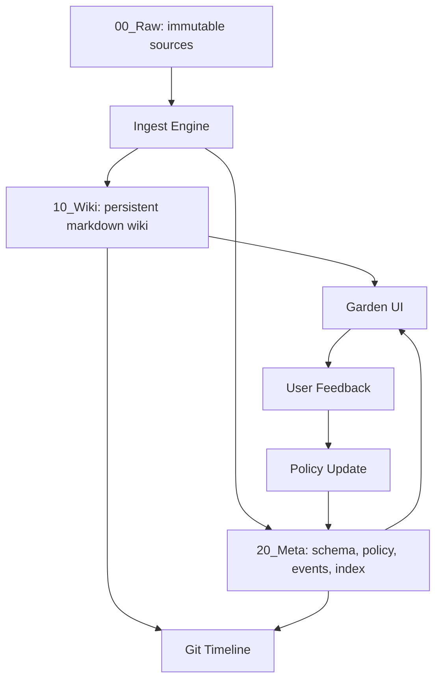
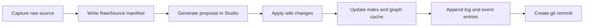
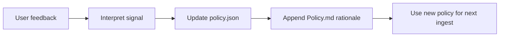

# P-Reinforce Blueprint

## 1. Origin

This product begins from Andrej Karpathy's LLM Wiki idea:

- Raw sources are immutable.
- The wiki is a persistent, compounding artifact.
- The schema teaches the LLM how to maintain the wiki with discipline.

Reference:
- https://gist.github.com/karpathy/442a6bf555914893e9891c11519de94f

P-Reinforce is not "a prettier note app". It is a long-horizon personal knowledge operating system built on top of Karpathy's architecture, with reinforcement-style policy adaptation layered on top.

The order matters:

1. Raw truth
2. Persistent wiki
3. Schema and conventions
4. Reinforcement policy
5. Automation and Git ops

If this order is violated, the system becomes fragile. If it is respected, the system can survive model changes, UI changes, and tool changes over many years.

## 2. Product Thesis

P-Reinforce should behave like an autonomous gardener:

- It does not overwrite truth.
- It compiles truth into durable knowledge.
- It maintains link integrity and synthesis over time.
- It learns the user's preferences through explicit and implicit feedback.
- It preserves all meaningful evolution in a timeline.

The human's role:

- curate sources
- ask good questions
- review high-impact changes
- teach preferences

The system's role:

- summarize
- classify
- cross-link
- detect contradiction
- maintain indices
- propose reorganization
- log all meaningful change

## 3. Non-Negotiable Invariants

These are system laws, not preferences.

### 3.1 Raw Is Immutable

`00_Raw/` is the source of truth.

- Never edit raw files in place.
- Never destroy original attachments.
- Every ingest operation references raw sources by stable IDs.
- Re-processing should create new derived artifacts, not mutate source evidence.

### 3.2 Wiki Is Rebuildable

`10_Wiki/` is valuable, but it must be reproducible from:

- raw sources
- policy state
- schema
- event logs

Anything that cannot be regenerated should be treated as critical metadata and stored in `20_Meta/`.

### 3.3 Schema Governs Behavior

The system should not rely on prompt memory alone.

Behavior must be anchored in:

- `AGENTS.md`
- page templates
- taxonomy rules
- policy state
- workflow contracts

### 3.4 Stable Identity Over Pretty Naming

File names, titles, and folder locations may change.
Knowledge identity must not.

Every node and every source should have a stable ID.

### 3.5 Every Automation Must Be Auditable

All important actions must leave evidence:

- what changed
- why it changed
- which sources influenced it
- which policy version was active
- which model and prompt version were used

### 3.6 Reinforcement Updates Policy, Not Truth

User feedback should alter:

- ranking
- classification preference
- trust thresholds
- link heuristics

It should not rewrite what the source said.

## 4. Canonical System Layers



### 4.1 Raw Layer

Contains the untouched evidence:

- text notes
- images
- clipped articles
- transcripts
- PDFs
- screenshots

### 4.2 Wiki Layer

Contains LLM-maintained markdown:

- concept pages
- decision pages
- project pages
- skill pages
- synthesis pages

### 4.3 Schema Layer

Contains operating rules:

- structure rules
- naming conventions
- page templates
- automation contracts

### 4.4 Policy Layer

Contains learned user preference:

- classification boundary shifts
- preferred category mapping
- link preferences
- confidence thresholds
- auto-apply rules

### 4.5 Ops Layer

Contains automation outputs:

- lint reports
- git sync events
- rebuild jobs
- migration notes

## 5. Recommended Repository Structure

```text
root/
├── 00_Raw/
│   └── YYYY/
│       └── MM/
│           └── DD/
│               └── source_<source_id>/
│                   ├── manifest.json
│                   ├── source.md
│                   └── attachments/
│
├── 10_Wiki/
│   ├── Projects/
│   ├── Topics/
│   ├── Decisions/
│   ├── Skills/
│   └── Views/
│
├── 20_Meta/
│   ├── AGENTS.md
│   ├── Policy.md
│   ├── policy.json
│   ├── taxonomy.yaml
│   ├── index.md
│   ├── index.json
│   ├── log.md
│   ├── graph.cache.json
│   ├── events/
│   ├── migrations/
│   └── reports/
│
├── 30_Ops/
│   ├── jobs/
│   ├── queue/
│   ├── exports/
│   └── snapshots/
│
└── .github/
    └── workflows/
```

Notes:

- Avoid emoji folder names in the actual filesystem.
- Emoji, color, and expressive naming belong in the UI layer.
- Keep disk layout boring and durable.

## 6. Core Domain Objects

### 6.1 RawSource

Represents one immutable evidence bundle.

```json
{
  "source_id": "src_20260414_ab12cd34",
  "schema_version": 1,
  "created_at": "2026-04-14T10:30:00Z",
  "source_type": "mixed",
  "origin": {
    "channel": "web_app",
    "captured_from": "manual_upload"
  },
  "title": "Toss payment UX observation",
  "sha256": "content_hash",
  "text_path": "00_Raw/2026/04/14/source_src_20260414_ab12cd34/source.md",
  "attachments": [
    {
      "attachment_id": "att_1",
      "path": "00_Raw/2026/04/14/source_src_20260414_ab12cd34/attachments/screen1.jpg",
      "mime_type": "image/jpeg"
    }
  ],
  "status": "captured"
}
```

### 6.2 WikiNode

Represents one persistent knowledge page.

Recommended frontmatter:

```yaml
---
id: node_topics_llm_wiki_persistent_artifact
schema_version: 1
node_type: topic
title: "Persistent Wiki as a Compounding Knowledge Artifact"
status: active
confidence_score: 0.86
created_at: 2026-04-14
updated_at: 2026-04-14
last_reinforced: 2026-04-14
category_path: "10_Wiki/Topics/Knowledge-Systems"
source_refs:
  - src_20260414_ab12cd34
related:
  - node_topics_rag_limitations
  - node_topics_knowledge_compounding
contradicts: []
policy_version: 3
last_commit: "abc1234"
---
```

### 6.3 PolicyState

Machine-readable preference state.

```json
{
  "version": 3,
  "updated_at": "2026-04-14T11:10:00Z",
  "classification_weights": {
    "Projects": 0.92,
    "Topics": 1.0,
    "Decisions": 0.88,
    "Skills": 0.81
  },
  "boundary_adjustments": [
    {
      "from": "development-code",
      "to": "business-insight",
      "reason": "user correction"
    }
  ],
  "auto_apply_thresholds": {
    "link_addition": 0.9,
    "minor_summary_update": 0.88,
    "folder_move": 0.96
  }
}
```

### 6.4 EventLog Entry

Append-only event facts.

```json
{
  "event_id": "evt_20260414_001",
  "timestamp": "2026-04-14T11:20:00Z",
  "event_type": "ingest_apply",
  "source_ids": ["src_20260414_ab12cd34"],
  "node_ids": ["node_topics_llm_wiki_persistent_artifact"],
  "policy_version": 3,
  "model": "gemini-3-flash-preview",
  "summary": "Created 1 topic node and updated 2 related pages"
}
```

## 7. Product Information Architecture

### 7.1 Primary Navigation

The product should be organized into six top-level surfaces.

#### Inbox

Purpose:

- capture raw text
- attach images
- drop files
- create immutable source bundles

Primary user question:

- "What new raw evidence came in today?"

#### Studio

Purpose:

- analyze a selected raw source
- generate or revise wiki nodes
- review markdown and graph proposals

Primary user question:

- "What should this source become?"

This is where the current service fits.

#### Garden

Purpose:

- browse the persistent wiki
- inspect topology
- detect hubs and orphans
- inspect folder organization

Primary user question:

- "What does my knowledge base currently look like?"

#### Reinforce

Purpose:

- capture user feedback
- explain why a classification happened
- tune boundaries and confidence policy

Primary user question:

- "How do I teach the system my judgment?"

#### Timeline

Purpose:

- show ingests
- show wiki changes
- show lint passes
- show git commits and sync failures

Primary user question:

- "What changed and why?"

#### Schema Lab

Purpose:

- edit templates
- inspect taxonomy
- evolve rules deliberately

Primary user question:

- "What operating system is governing the wiki?"

### 7.2 Screen-Level Responsibilities

| Screen | Source of truth | Can edit? | Main output |
|---|---|---:|---|
| Inbox | Raw manifest | Yes | source bundle |
| Studio | Proposal state | Yes | wiki patch proposal |
| Garden | Wiki + graph cache | No | structural understanding |
| Reinforce | policy state | Yes | policy updates |
| Timeline | event log | No | historical trace |
| Schema Lab | AGENTS/template/policy schema | Yes | rule evolution |

## 8. Operating Workflows

### 8.1 Ingest



Steps:

1. Save raw source as immutable bundle.
2. Analyze source with the current schema and policy.
3. Produce candidate wiki changes.
4. Apply changes according to confidence and trust level.
5. Refresh `index.md`, `index.json`, and `graph.cache.json`.
6. Append events and log entries.
7. Commit and optionally push.

### 8.2 Reinforce



Allowed user signals:

- praise classification
- correct folder/category
- accept or reject links
- mark summary as too broad or too narrow
- mark auto-apply as too aggressive or too cautious

### 8.3 Query

Query should read from the wiki first, not raw sources by default.

Policy:

- read `index.md` or `index.json`
- identify relevant nodes
- answer from the wiki with citations
- optionally file the answer back as a new node if it has durable value

### 8.4 Lint

Lint should be a first-class workflow, not a future nice-to-have.

Checks:

- orphan pages
- stale summaries
- contradiction candidates
- pages with weak provenance
- missing pages for repeated concepts
- folders exceeding refactor threshold
- broken links

### 8.5 Rebuild

This is the long-term survival workflow.

When models improve:

- replay selected raw sources
- compare old and new synthesized nodes
- keep stable IDs
- record migrations

This is what protects the user from "10 years built on a bad early choice."

## 9. Trust and Automation Model

The system needs trust levels.

### Level 0: Manual

- system proposes
- user approves every meaningful change

### Level 1: Assisted

- system can auto-apply low-risk edits
- user reviews structural edits

### Level 2: Semi-Autonomous

- system can create new nodes and links
- folder moves and refactors still require approval

### Level 3: Autonomous Gardener

- system can batch-ingest and maintain wiki
- destructive or structural changes still produce reversible migration notes

Recommended early target:

- Studio UI should support Level 0 and Level 1 first.
- Do not start at Level 3.

## 10. Foldering Strategy

The user's proposed structure is directionally right, but should be treated as a semantic view, not absolute ontology.

Recommended top-level semantic categories:

- `Projects`: time-bound or goal-bound work
- `Topics`: enduring concepts and knowledge domains
- `Decisions`: judgment, tradeoffs, rationale
- `Skills`: repeatable workflows, prompts, methods
- `Views`: curated meta pages, comparison tables, maps

Rules:

- pages can belong primarily to one category path
- cross-category relevance belongs in links, not duplicated placement
- if a folder exceeds 12 high-density files, recommend subdivision
- never move pages silently across major categories

## 11. Git and Versioning Policy

The wiki should be a git repo.

But Git is not the only history:

- git records file change history
- event logs record semantic operations

Commit message shape:

```text
[P-Reinforce] ingest: created 1 topic node, updated 3 links
[P-Reinforce] reinforce: boundary shift Topics -> Decisions
[P-Reinforce] lint: fixed orphan links and refreshed index
```

Git rules:

- commits must be atomic by workflow
- failed pushes must create visible warnings
- commit hashes should be referenced in important nodes only as the latest known trace, not as the sole history

## 12. API and Service Boundaries

### 12.1 Frontend App

Responsibilities:

- capture input
- preview proposals
- browse graph and markdown
- show timeline and policy state

### 12.2 Knowledge Service

Responsibilities:

- invoke LLM
- validate outputs
- compute diffs
- apply trust rules

### 12.3 Workspace Agent

Responsibilities:

- watch local folders
- write wiki files
- rebuild index and graph
- run lint
- run git ops

This is why the long-term product is hybrid:

- web app for experience
- local agent for durable filesystem ownership

### 12.4 Search Service

Future responsibilities:

- fast page search
- hybrid retrieval for large wikis
- citation helpers

## 13. Current Codebase Mapping

Current implementation status:

- A working Studio exists.
- Gemini-based text + image ingestion exists.
- Markdown preview exists.
- Knowledge graph visualization exists.
- Vercel deployment exists.

This means the current application is best understood as:

`P-Reinforce / Studio / v0`

It is not yet:

- a persistent wiki manager
- a policy engine
- a local knowledge workspace orchestrator
- a 10-year operational system

## 14. Immediate Build Direction

The next implementation focus should be:

1. Add app-level navigation for Inbox, Studio, Garden, Reinforce, Timeline, Schema Lab.
2. Introduce persistent domain models: RawSource, WikiNode, PolicyState, EventLog.
3. Save structured artifacts instead of only showing generated results.
4. Add policy feedback capture and explainability.
5. Add index/log generation.
6. Add local workspace mode after the core contracts stabilize.

## 15. Failure Modes To Design Against

These are the 10-year risks.

### Silent schema drift

The system starts producing inconsistent pages because prompts changed informally.

Mitigation:

- version schema
- version templates
- record model and policy versions in events

### Over-automation

The system aggressively reorganizes the wiki and destroys trust.

Mitigation:

- trust levels
- reversible migrations
- explicit approvals for structural moves

### Folder lock-in

The user's early taxonomy becomes a prison.

Mitigation:

- stable node IDs
- links over strict hierarchy
- periodic refactor proposals

### Model lock-in

The product becomes coupled to one provider.

Mitigation:

- normalize outputs
- treat model output as proposal, not truth
- keep rebuild path from raw sources

### Provenance loss

Pages become compelling but unsupported.

Mitigation:

- source refs are mandatory
- lint for weak provenance

## 16. Product Definition

One-sentence product definition:

P-Reinforce is a schema-governed, LLM-maintained, Git-backed persistent wiki system that transforms immutable raw inputs into an interlinked personal knowledge base that compounds for years.

One-sentence implementation definition:

The current web service should evolve into the Studio surface of that system, not remain the whole system.
